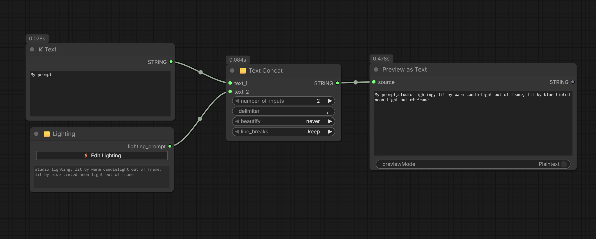

# My Lighting — ComfyUI Custom Node

A custom node for [ComfyUI](https://github.com/comfyanonymous/ComfyUI) that lets you visually set up a lighting scene and automatically generate a detailed prompt string describing it.


---

---


---

## Features

- **Visual diagram** — place light sources on a top-down circular canvas by clicking and dragging
- **8 light types** — Sunlight, Window, Candlelight, Neon, Spotlight, Studio, Fire, Moonlight
- **Per-light controls** — visibility (in frame / off frame), intensity, distance, height, quality, color
- **Global mood** — Golden Hour, Blue Hour, Cinematic, Chiaroscuro, and more
- **Presets** — save and reload full lighting setups, stored locally in a JSON file
- **Live preview** — the generated prompt updates in real time inside the modal
- **Output** — a single `STRING` output ready to plug into any prompt node

---

## Installation

1. Clone or download this repository into your ComfyUI `custom_nodes` folder:

```
ComfyUI/
└── custom_nodes/
    └── comfyui-my-lighting/   ← this folder
```

```bash
cd ComfyUI/custom_nodes
git clone https://github.com/YOUR_USERNAME/comfyui-my-lighting
```

2. Restart ComfyUI.

3. The node appears in the node menu under **MY NODES → My Lighting**.

---

## File Structure

```
comfyui-my-lighting/
│
├── __init__.py                  # Registers the node with ComfyUI
├── My_Lighting.py               # Python node + REST endpoints for presets
├── my_lighting_presets.json     # Created automatically when you save your first preset
│
└── web/
    └── My_Lighting.js           # Frontend — modal, canvas diagram, UI logic
```

> **Note:** The `web/` subfolder must be named exactly `web` so ComfyUI serves the JS file automatically.

---

## Usage

1. Add the **My Lighting** node to your workflow.
2. Click **⚡ Edit Lighting** to open the setup modal.
3. Select a light type in the grid, then click anywhere on the diagram to place it.
4. Drag the light icon to adjust its position and distance.
5. Right-click a light on the diagram to remove it.
6. Adjust per-light settings in the list below the diagram:
   - **Visible** — checked = light is visible in the frame, unchecked = off frame
   - **Intensity** — Low / Med / High
   - **Dist.** — distance from subject (read from diagram position)
   - **Height** — Low / Mid / High (angle relative to subject)
   - **Quality** — optional: Soft, Hard, Diffuse, Harsh, Warm, Cold
   - **Color** — custom color tint via color picker
7. Set a **Global Mood** if needed.
8. Use **Presets** to save or reload full lighting configurations.
9. Click **✔ Apply** — the prompt updates in the node and is sent to Python on generation.

---

## Output Example

```
golden hour, soft golden sunlight from the front-right nearby, lit by warm candlelight out of frame from above, hard spotlight from the left very close
```

---

## Preset Storage

Presets are saved in `my_lighting_presets.json` in the node folder. This file is created automatically on first save. You can back it up, version it, or share it manually.

---

## Compatibility

- ComfyUI (any recent version)
- Python 3.10+
- No additional dependencies required

---

## License

MIT
